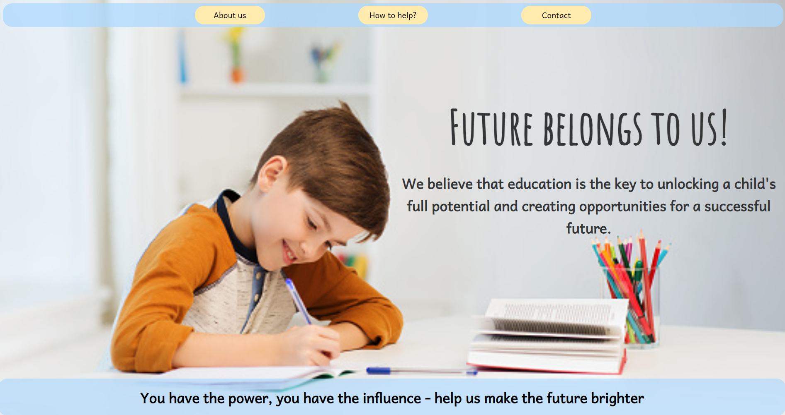
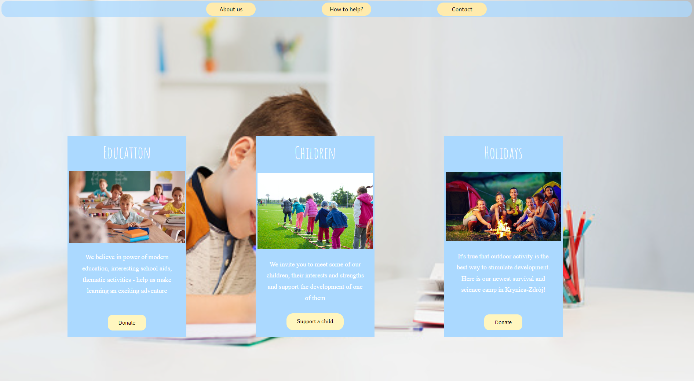
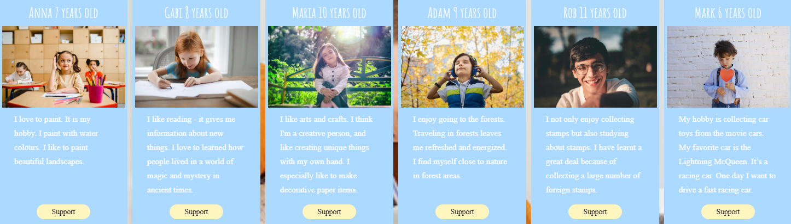

<a name="readme-top"></a>


<h1>Future belongs to us</h1>


## Contributors
<ul>
    <li><a href="https://github.com/UllaMos">Urszula Moskalik</li> 
    <li><a href="https://github.com/Agataa02">Agata Gruszka</li> 
    <li><a href="https://github.com/Satora1">Jakub Satora</li>  
    <li><a href="https://github.com/LeonBochenek">Leon Bochenek</li>  
    <li><a href="https://github.com/ignacyD">Ignacy Gąsiorowski</li>   
</ul>

## Mentors 
<ul>
    <li>Katarzyna Mrawczyńska</li> 
    <li>Łukasz Dutka</li> 
    <li>Adrian Widłak</li> 
</ul>


## About The Project



The project involved creating a website for a foundation that helps children in need.

The first step in the project was to talk about general conception. Based on these discussions, a plan was developed for the website design, content, and functionality.

The design phase of the project involved creating a mockup of the website's layout and visual elements. We wanted a bright, cheerful design that would appeal to children and families, while still conveying a sense of professionalism and trustworthiness. Once that was done, the website's content was developed.

Overall, we made a professional, user-friendly website.

<p align="right">(<a href="#readme-top">back to top</a>)</p>

## Getting Started

What to do to start the project

### Prerequisites

Update node package manager with this command:
```sh
  npm install npm@latest -g
```
### Installation

1. Clone the repo
   ```sh
   git clone https://github.com/CodecoolGlobal/react-for-a-cause-react-ignacyD
   ```
2. Install NPM packages
   ```sh
   npm install
   ```
3. Run the project
   ```sh
   npm start
   ```


<p align="right">(<a href="#readme-top">back to top</a>)</p>

### Used Technologies

    We were coding in Javascript, HTML and CSS and using Git with GitHub as version control system.

### Built With

* [![React][React.js]][React-url]

<p align="right">(<a href="#readme-top">back to top</a>)</p>


## Usage




<p align="right">(<a href="#readme-top">back to top</a>)</p>


## Contact

Project Link: [https://github.com/CodecoolGlobal/react-for-a-cause-react-ignacyD](https://github.com/CodecoolGlobal/react-for-a-cause-react-ignacyD)

<p align="right">(<a href="#readme-top">back to top</a>)</p>


[React.js]: https://img.shields.io/badge/React-20232A?style=for-the-badge&logo=react&logoColor=61DAFB
[React-url]: https://reactjs.org/
